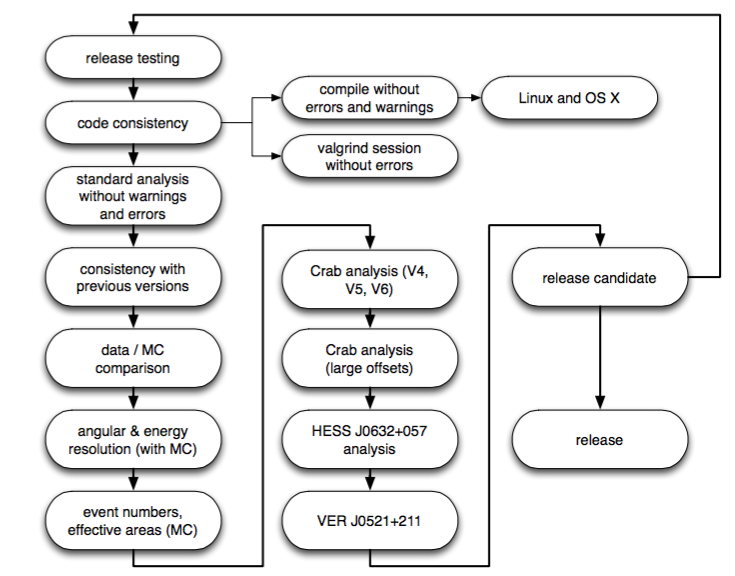

# Eventdisplay Release Tests

**Release tests for versions before v490: see https://github.com/VERITAS-Observatory/Eventdisplay_ReleaseTests**

## Introduction

Releases of Eventdisplay are required to pass a list of testing procedures before being tagged for science analysis.

Testing a release needs time and should cover large parts of the parameter space (zenith angle, epochs and atmospheres, NSB range, ...).
Note that it is impossible to test every single IRF function and every single possible science case.

This repository contains code and macros for release testing. Results of release tests are saved in separate repositories (see e.g., for [v490](https://github.com/VERITAS-Observatory/EventDisplay_ReleaseTests_v490)).

Simplified overview of the testing (somewhat outdated): 



## Abbreviations:

- SZE = small zenith angles (0-40deg)
- MZE = medium zenith angles (40-50 deg)
- LZE = large zenith angles (50-70 deg)

## Directory structure

- directory contains topical macros / scripts: [./releasetests/](./releasetests)
- most important comparisons are:
   - data/mc comparision in [./releasetests/montecarlo/mc_data_comparision](./releasetests/montecarlo/mc_data_comparision)
   - Crab analysis in [releasetests/sources/Crab](releasetests/sources/Crab)
- steering of macros/scripts with run parameter files (see example [./v487/V6.runparameter.dat](./v487/V6.runparameter.dat)


# Testing the release of a new Eventdisplay version

The following points are required for a full release tests, including consistency
tests for the instrument response functions

## Checklist for release

- [ ] check that version number is correct: `./bin/evndisp --version` (needs to be adjusted in Makefile and src/VGlobalRunParameter.cpp)
- [ ] compilation of all steps with warnings and errors
  - [ ] linux
  - [ ] OS X
- [ ] for releases with many changes: use valgrind to check for memory leaks
  - [ ] e.g., `valgrind --log-file=valgrind.evndisp.log ./bin/evndisp <command line parameters>`
- [ ] use display to look through a number (>10) of data and MC events
  - [ ] do images look reasonable (e.g. ellipses?, islands?, etc)
  - [ ] location of FADC integration window (check high and low-gain channels)
  - [ ] pedestal level correct?
  - [ ] for MC: check direction and core reconstruction (the true position is plotted also in the display)
  - [ ] check other tabs: pedestal, pedestal variations, gains, etc. 
- [ ] MC / data comparision (see below)
- [ ] Instrument response functions tests (see below)
- [ ] Tests with known sources
  - [ ] Crab Nebula
  - [ ] other sources for soft spectra, hard spectra, ...
- [ ] prepare wiki page with new release information

## MC / data comparision

Comparision of distributions obtained from Crab observations (on-off) and 
simulated gamma rays.
Verifies that MC model describes sufficiently well the data.

Input:
- mscw_energy files from Crab observations
- mscw_energy files from MC simulations

Code:
- [releasetests/montecarlo/mc_data_comparision](releasetests/montecarlo/mc_data_comparision)

Examples e.g., in [./v483b/montecarlo/mc_data_comparision](./v483b/montecarlo/mc_data_comparision)

- [ ] SZE and LZE comparison
- [ ] per major epoch (V4, V5, V6)
- [ ] per V6 minor epoch (V6_2013, V6_2014, ...)

## Completeness of IRFs

Check for successful lookup table mergine:
```
cd releasetests/lookuptable-testing
./test_tables.sh
```

## Correction factors and NSB

Checks that correction factors are correctly applied.

Input:
- mscw_energy files from MC simulations (note: usually these files are not on disk)
- correction factors from $VERITAS_EVNDISP_AUX 

Code:
- [releasetests/nsb](releasetests/nsb)

Examples, e.g., in [./v483b/nsb/](./v483b/nsb/)

- [ ] correction factors vs pedvars

## Instrument response functions 

Compare effective areas at fixed energies and energy thresholds. 
Code can be found in [releasetests/montecarlo/energythresholds](releasetests/montecarlo/energythresholds).

Examples e.g., in [./v483b/energytresholds/](./v483b/energytresholds/)

- [ ] energy thresholds
- [ ] effective areas at 300 GeV, 500 GeV, 1 TeV

Compare effective areas between different epochs.
(not completely implemented yet)

Examples e.g., in v483/montecarlo/irf_plotting

- [ ] effective areas
- [ ] angular / energy resolution plots

## Crab Nebula

- [ ] light curves (flux vs MJD)
- [ ] SZE and LZE spectra
- [ ] spectra per major epoch (V4, V5, V6)
- [ ] spectra per V6 minor epoch (V6_2013, V6_2014, ...)

# Production scripts

## Radial acceptances

Calculate and test radial acceptance files.

Examples in e.g., [./v483b/radialAcceptances](./v483b/radialAcceptances)

